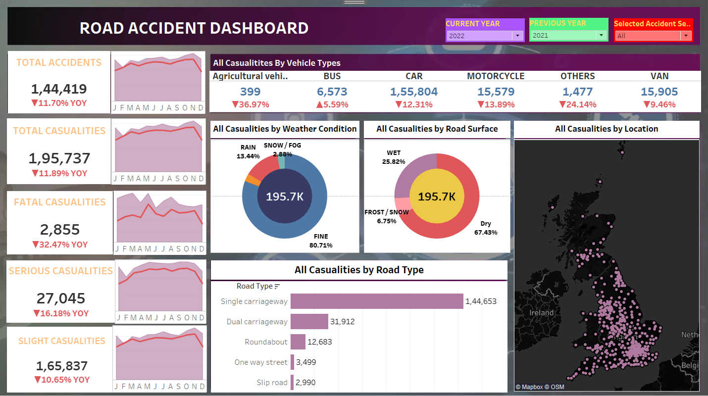

# 🚗 Road Accident Dashboard

An interactive data visualization dashboard built to analyze road accident data with rich insights into accident severity, vehicle types, weather/road conditions, and geographical distribution.

## 📊 Dashboard Features

- **Total Accident Statistics**
  - Year-over-year comparison for total, fatal, serious, and slight casualties.
- **Vehicle Type Breakdown**
  - Categorized casualty data by vehicle types (Car, Motorcycle, Van, Bus, etc.).
- **Weather & Surface Conditions**
  - Casualty statistics based on weather and road surface at the time of accidents.
- **Road Type Analysis**
  - Insights into where accidents are most frequent (Single carriageway, Roundabout, etc.).
- **Location Mapping**
  - Geographical distribution of casualties across the UK.

## 🛠️ Tools & Technologies

- **Tableau** - BUILD KPI FOR TYPES OF VEHICLES AND NO.OF ACCIDENTS ACCORDING TO THE TYPES LIKE SERIOUS,FATAL,SLIGHT,ETC 
- **Excel / CSV** for raw data processing
- **Mapbox** for geospatial mapping
- **Data Cleaning & Preprocessing** handled in spreadsheet or scripting tool ( Python/Pandas)

## 📌 Insights

- Single carriageway roads are the most accident-prone.
- Majority of accidents occur in fine weather and dry road conditions.
- Car and motorcycle accidents form a significant portion of total casualties.
- Year-over-year trends indicate a decline in most categories, including a 32.47% drop in fatal casualties.

